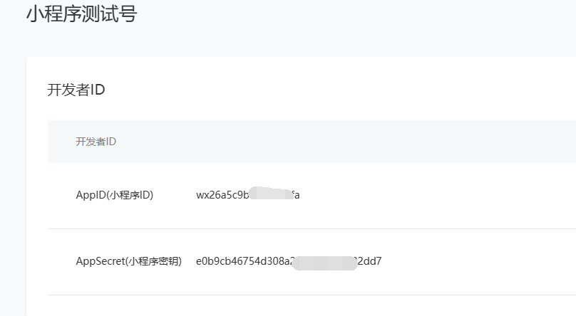
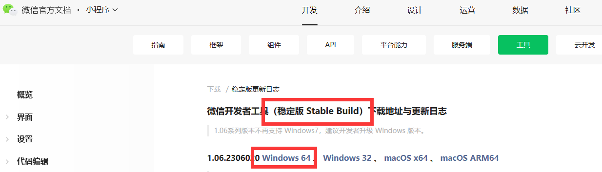
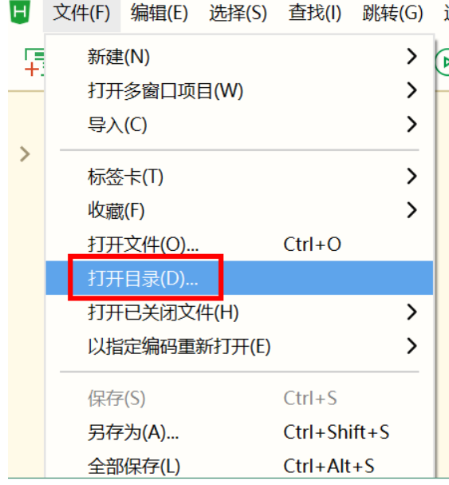

# 搭建微信小程序前端环境

## 一、申请小程序测试号

## 1.1 申请测试号

申请地址：https://mp.weixin.qq.com/wxamp/sandbox?doc=1

使用微信扫描网页的二维码进行申请，申请成功后，进入页面，获取小程序ID和密钥

## 1.2 下载微信Web开发者工具

地址：https://developers.weixin.qq.com/miniprogram/dev/devtools/download.html

## 二、下载和安装HBuilder

## 2.1 下载安装

下载地址：https://www.dcloud.io/hbuilderx.html

## 2.2 打开小程序代码

找到小程序代码目录，启动HBuilder，点击文件 -> 打开目录

## 1.3 HBuilder运行配置

### 2.3.1 打开配置 manifest.json

Dcloud_AppID 与 Vue 版本的设置

### 2.3.2 小程序运行选项配置

- AppId 为开发人员自己的小程序 AppId
- 检查安全域名和 TLS 版本与微信开发者工具的配置是相反的，所以在此是不需要选择
- 地址位置的应用需要进行权限的配置，可以填写获取位置的需求描述

### 2.3.3 运行设置

想要将当前项目运行到小程序，需要进行将 Hbuilder与微信开发者工具进行关联，所以需要在 Hbuilder 开发工具，“运行”->“运行到小程序模拟器”->“运行时设置”->“微信开发者工具路径”中进行路径设置

### 2.3.4 安全端口设置

由于微信小程序开发工具不会随便与第三方开发工具进行衔接，需要打开微信开发者工具的安全设置项

## 三、配置内网穿透

### 3.1 注册用户

网址：https://ngrok.cc/login/register

### 3.2 实名认证

**（1）注册成功之后，登录系统，进行实名认证，认证费2元，认证通过后才能开通隧道**

### 3.3 开通隧道

**（1）选择隧道管理 -> 开通隧道**

**最后一个是免费服务器，建议选择付费服务器，10元/月，因为免费服务器使用人数很多，经常掉线**

**（2）点击立即购买 -> 输入相关信息**

**（3）开通成功后，查看开通的隧道**

**这里开通了两个隧道，一个用于后端接口调用，一个用于公众号前端调用**

### 3.4 启动隧道

**（1）下载客户端工具**

**（2）选择windows版本**

**（3）解压，找到bat文件，双击启动**

**（4）输入隧道id，多个使用逗号隔开，最后回车就可以启动**

### 3.5 修改代码路径

修改项目 common -> http.interceptor.js 文件中为内网穿透域名地址

## 四、启动项目

### 